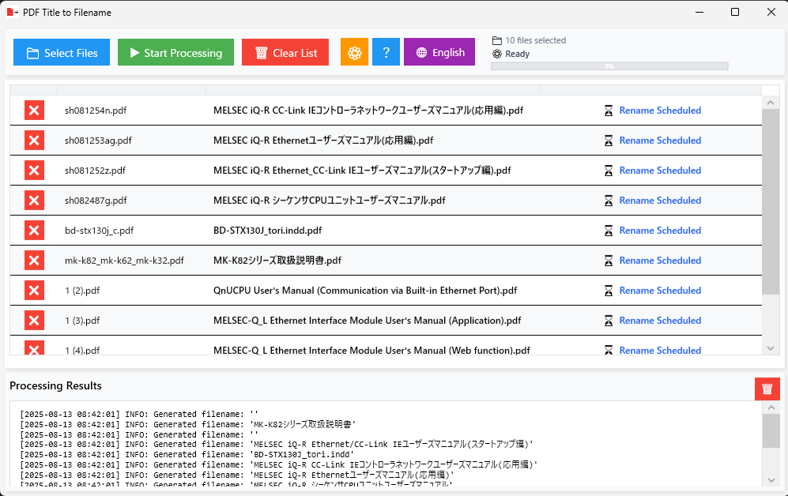

# PDF Title to Filename


**[English](#pdf-title-to-filename) | [日本語](#pdf-title-to-filename-1)**

---

A fast and lightweight Windows application that extracts titles from PDF metadata and automatically sets them as filenames. Perfect for organizing large collections of PDF documents with meaningful, searchable filenames.



## ✨ Features

- **🚀 Fast Processing** - Optimized performance through extensive code refinement
- **📦 Single Executable** - Self-contained application with no .NET Runtime dependency
- **🌐 Multi-language Support** - Seamless Japanese and English interface
- **📁 Drag & Drop Support** - Intuitive batch processing with simple file dragging
- **📊 Table Display** - Clear overview of current names, new names, and processing status
- **⚡ Lightweight Design** - Minimal footprint with optimized dependencies
- **🔄 Asynchronous Processing** - Non-blocking UI with background processing
- **🎨 Modern UI** - Elegant Material Design-inspired interface
- **🔍 Recursive Folder Search** - Automatic subfolder scanning when dropping directories
- **⚙️ Advanced Settings** - Granular control over filename generation parameters
- **🔤 NFKC Normalization Control** - Precise control over character width conversion
- **📋 No Metadata Support** - Intelligent handling of files without metadata
- **🛡️ Robust Error Handling** - Comprehensive error recovery and user feedback
- **🔒 Settings Validation** - Smart prevention of invalid configuration settings
- **📝 Conditional Logging** - Adaptive logging based on build configuration

## 🎯 Performance Optimization

### **Single File Distribution**
- ✅ **No .NET Runtime Required** - Self-contained executable
- ✅ **Compression Optimization** - Minimum size through EnableCompressionInSingleFile
- ✅ **Code Trimming** - Automatic removal of unused code
- ✅ **Easy Distribution** - Works with just one exe file

## 🌐 Multi-language Support

### **Supported Languages**
- **Japanese** - Complete Japanese UI support
- **English** - Complete English UI support

### **Language Switching Features**
- **Auto Detection** - Automatic language selection based on system language
- **Manual Switching** - Instant switching via language toggle button
- **Settings Persistence** - Persistent language selection

### **Localization Scope**
- **UI Elements** - All buttons, labels, menus
- **Error Messages** - Comprehensive error message localization
- **Log Messages** - Complete processing log localization
- **Settings Screen** - All elements in settings window
- **App Information** - About screen and license information

## 🖼️ Features

### PDF Processing Features
- **Metadata Extraction**: Automatic extraction of title information from PDF files
- **Character Normalization**: Full-width to half-width conversion (NFKC normalization)
- **Filename Sanitization**: Automatic replacement of Windows invalid characters
- **Duplicate Avoidance**: Automatic sequential numbering for files with same names
- **Error Detail Display**: Detailed display of error reasons
- **Preview Functionality**: Preview new filenames before processing
- **Recursive Folder Search**: Automatic search for all PDF files in dropped folders
- **Settings-based Processing**: Processing considering only enabled metadata items
- **No Metadata Detection**: Appropriate processing when all enabled metadata in settings is empty
- **Encoding Support**: Additional encoding support such as Shift_JIS
- **Settings Validation**: Prevention of processing when all PDF metadata items (Title, Author, Subject, Keywords) are disabled
- **Conditional Logging**: Detailed log output only in debug builds, optimized in release builds

### User Interface
- **Table Display**: List display of current names, new names, and status
- **Progress Bar**: Real-time display of processing progress
- **Log Viewer**: Detailed confirmation of processing results
- **Low Resolution Support**: Design suitable for small screens
- **Drag & Drop**: Direct drop of files or folders
- **Status Icons**: Visually clear status display
- **Responsive Design**: Automatic adjustment based on window size
- **Integrated App Information**: Tabbed window displaying app information and open source licenses
- **Settings Window**: Detailed customization functionality for filename generation
- **Real-time Preview**: Immediate preview updates when settings are changed
- **Language Switching**: Instant switching between Japanese and English

### Status Display
- **📋 Rename Pending**: Files waiting for processing
- **⚙️ Processing...**: Currently processing files
- **✅ Rename Complete**: Successfully renamed files
- **⚠️ No Title**: Files without title information in PDF
- **⚠️ No Metadata**: Files where all enabled metadata in settings is empty
- **ℹ️ No Change Needed**: Files that already have appropriate filenames
- **❌ Error**: Files with errors during processing

### Settings Features
- **Filename Element Customization**: Combination of title, author, subject, keywords, original filename, prefix, suffix
- **Element Order Change**: Element order adjustment with arrow buttons
- **NFKC Normalization Control**: Item-specific enable/disable settings for full-width to half-width conversion
- **Custom Strings**: Free setting of prefixes and suffixes
- **Separator Settings**: Customization of separator characters between elements
- **Real-time Preview**: Immediate preview updates when settings are changed
- **Settings Persistence**: Settings saved to Windows standard AppData/Local (with fallback functionality)
- **Language Settings**: Persistence of selected language
- **Settings Validation**: Warning display and processing prevention when all PDF metadata items are disabled
- **Immediate Reflection**: Immediate reflection after settings changes (no application restart required)

## 🛠️ Technical Specifications

### Development Environment
- **.NET 8.0** (Latest LTS)
- **WPF** (Windows Presentation Foundation)
- **C# 12.0**

### Optimized Dependencies
- **UglyToad.PdfPig** - High-speed PDF processing
- **Microsoft.Extensions.DependencyInjection** - Dependency injection
- **Microsoft.Extensions.Logging** - Minimal logging configuration
- **System.Text.Encoding.CodePages** - Additional encoding support

### Architecture
- **MVVM Pattern** - Model-View-ViewModel design
- **Dependency Injection** - Loose coupling design
- **Asynchronous Processing** - async/await pattern
- **Reactive UI** - Two-way binding with INotifyPropertyChanged
- **Command Pattern** - UI operations with RelayCommand
- **Localization** - Resource-based multi-language support

### Detailed Implementation Specifications

#### PDF Processing Service (PdfProcessingService)
- **Asynchronous Processing**: Background processing with Task.Run
- **Encoding Support**: Shift_JIS support via CodePagesEncodingProvider
- **Filename Normalization**: Full-width to half-width conversion with NFKC normalization
- **Invalid Character Removal**: Automatic replacement of Windows invalid characters
- **Reserved Word Avoidance**: Automatic avoidance of Windows reserved words
- **Duplicate Processing**: Duplicate avoidance with sequential numbering
- **File Existence Check**: File existence confirmation before processing
- **Localization Support**: Multi-language support for log messages

#### ViewModel (MainWindowViewModel)
- **Reactive Updates**: Automatic UI updates with PropertyChanged
- **Command Management**: UI operation control with RelayCommand
- **Asynchronous Processing**: Asynchronous file processing with async/await
- **Error Handling**: Comprehensive exception handling
- **Preview Functionality**: Filename prediction before processing
- **Language Service**: Integration of multi-language support

#### UI Implementation (MainWindow)
- **Drag & Drop**: Direct drop support for files and folders
- **Recursive Search**: Automatic search for all PDF files in folders
- **Access Permission Handling**: Proper handling of permission errors
- **Responsive**: Automatic adjustment based on window size
- **Language Switching**: Instant language switching functionality

#### Language Service (LanguageService)
- **Resource Management**: Resource file-based multi-language support
- **Auto Detection**: Automatic system language detection
- **Fallback**: English fallback functionality
- **Dynamic Switching**: Runtime language switching
- **Settings Integration**: Persistent language settings

## 🚀 Build and Execution Methods

### Production (Recommended)
```bash
# Create optimized single executable file
build.bat
```
**Output Location**: `publish/PDF_Title_to_Filename.exe` (Single file, no .NET Runtime required)
**Features**: Optimized, detailed logging disabled, distribution ready

### Debug
```bash
# Debug build with detailed logging enabled
build-debug.bat
```
**Output Location**: `PDF_Title_to_Filename\bin\Debug\net8.0-windows\win-x64\PDF_Title_to_Filename.exe`
**Features**: Detailed logging enabled, debug symbols enabled, for development and troubleshooting

### Manual Build
```bash
# Restore dependencies
dotnet restore

# Debug build (detailed logging enabled)
dotnet build --configuration Debug

# Release build (optimized)
dotnet build --configuration Release

# Optimized publish
dotnet publish --configuration Release
```

## 📖 Usage

### Basic Operations
1. **Launch Application**: Run `PDF_Title_to_Filename.exe` (No .NET Runtime required)
2. **Language Switch**: Toggle between Japanese and English using the 🌐 button
3. **Settings Customization**: Configure detailed filename generation settings via the ⚙️ button
4. **Add Files**: 
   - Drag and drop PDF files directly into the table area
   - Use the "Select Files" button for traditional file selection
   - Drop entire folders to automatically scan for all PDF files within
5. **Preview Confirmation**: Review expected filenames in the preview table
6. **Execute Processing**: Click the "Start Processing" button to begin
7. **Check Results**: Monitor processing results in the status column and log area
8. **App Information**: Access app information and open source licenses via the "?" button

### Language Switching Features
- **Automatic Language Selection**: Automatic selection based on system language
- **Manual Switching**: Instant switching with 🌐 button
- **Settings Persistence**: Selected language is maintained on next startup

### Detailed Settings Features

#### Settings File Storage Location
Application settings are saved in the following priority order:

1. **Same Folder as Executable** (Recommended/Default)
   - Location: `PDF_Title_to_Filename.json`
   - Settings stored alongside the application
   - Portable configuration
   - Settings move with the application

2. **AppData/Local** (Fallback 1)
   - Location: `%LOCALAPPDATA%\PDF_Title_to_Filename\PDF_Title_to_Filename.json`
   - Windows standard application settings storage location
   - Independent settings per user
   - Used when executable directory is not writable

3. **User Documents Folder** (Fallback 2)
   - Location: `%USERPROFILE%\Documents\PDF_Title_to_Filename\PDF_Title_to_Filename.json`
   - Alternative location when other locations are not accessible

**Note**: Settings are now primarily saved in the same folder as the executable for better portability and easier management.

**How to Check Settings File Location**:
- Open `%LOCALAPPDATA%\PDF_Title_to_Filename\` folder in Windows Explorer
- Run `Get-ChildItem "$env:LOCALAPPDATA\PDF_Title_to_Filename\PDF_Title_to_Filename.json"` in PowerShell
- If the settings file doesn't exist, it will be automatically created when you change and save settings in the application

#### Filename Element Settings
1. **Open Settings Window**: Click the ⚙️ button in the main window
2. **Enable Elements**: Check the checkboxes for elements you want to use
3. **Adjust Order**: Change element order with arrow buttons
4. **Custom Strings**: Freely set prefixes and suffixes
5. **Separator Settings**: Customize separator characters between elements
6. **Real-time Preview**: Preview is updated immediately when settings are changed

#### NFKC Normalization Control
- **Applied Items**: PDF title, author, subject, keywords
- **Excluded Items**: Original filename, prefix, suffix
- **Effect**: Convert full-width alphanumeric to half-width (e.g., `ＡＢＣ` → `ABC`)

#### No Metadata Processing
- **Criteria**: When all enabled metadata items in settings are empty
- **Processing**: Skip renaming as "No Metadata"
- **Display**: Show with ⚠️ icon in status

#### Settings Validation Feature
- **Check Targets**: PDF metadata items (Title, Author, Subject, Keywords)
- **Invalidation Prevention**: Prevent processing when all metadata items are disabled
- **Warning Display**: Show warning message when attempting to process with invalid settings
- **Button Control**: "Start Processing" button is disabled with invalid settings
- **Real-time Updates**: Button state is updated immediately when settings are changed

#### Conditional Logging Feature
- **Debug Build**: Detailed log output (metadata details, filename generation process, etc.)
- **Release Build**: Basic logs only (performance optimized)
- **Build Scripts**: `build-debug.bat` for debug, `build.bat` for release
- **Development Support**: Provide detailed information for problem identification and debugging

### License Information Confirmation
How to check open source licenses within the application:

1. **Open App Information Window**: Click the "?" button in the main window
2. **Select License Tab**: Click the "Open Source Licenses" tab
3. **Select Library**: Scroll through each library's license text to confirm
4. **Detailed Information**: Display version information and complete license text

**Displayed License Information**:
- **UglyToad.PdfPig**: Apache License 2.0 (PDF processing library)
- **Microsoft.Extensions.DependencyInjection**: MIT License (Dependency injection)
- **Microsoft.Extensions.Logging**: MIT License (Logging functionality)
- **System.Text.Encoding.CodePages**: MIT License (Encoding support)
- **.NET Runtime**: MIT License (Runtime environment)

### Display Items
- **Current Name**: Original filename
- **New Name**: Filename after renaming
- **Status**: Processing status (waiting, processing, rename complete, error, etc.)
- **Operations**: File delete button

## 🔧 Processing Specifications

### Filename Normalization
1. **Character Conversion**: Full-width alphanumeric → Half-width alphanumeric (NFKC normalization)
2. **Invalid Character Removal**: Windows invalid characters (`< > : " / \\ | ? *`) → `_`
3. **Whitespace Normalization**: Consecutive spaces → Single space
4. **Reserved Word Avoidance**: Automatic avoidance of Windows reserved words
5. **Length Limitation**: Automatic truncation at 240 characters (considering Windows maximum path length)

### Duplicate Processing
```
Original file: document.pdf
When duplicated: document(1).pdf, document(2).pdf, ...
```

### Smart Processing
- **Completed Skip**: Skip processing files marked as "Rename Complete"
- **Error Details**: Display detailed error reasons on mouse hover
- **Fast Processing**: Several times faster processing speed through optimization
- **Preview Functionality**: Preview new filenames before processing

### Error Handling
- **PDF Reading Errors**: Corrupted files and access permission errors
- **Filename Errors**: Automatic avoidance of invalid characters and reserved words
- **Duplicate Errors**: Automatic sequential numbering for files with same names
- **Permission Errors**: Skip processing read-only files
- **Drag & Drop Errors**: Proper handling of invalid file formats
- **Settings File Errors**: Proper handling of settings save/load errors

### Recursive Folder Search
- **Subfolder Search**: Recursively search all subfolders within specified folders
- **Access Permission Handling**: Automatically skip inaccessible folders
- **PDF File Auto Detection**: Automatic detection by file extension

## 🧪 Development and Testing

### Development Environment Setup
```bash
# Clone repository
git clone https://github.com/fa-yoshinobu/PDF_Title_to_Filename.git
cd PDF_Title_to_Filename

# Restore dependencies
dotnet restore

# Debug build
dotnet build

# Optimized publish
dotnet publish --configuration Release
```

### Project Structure
```
PDF_Title_to_Filename/
├── PDF_Title_to_Filename.sln          # Solution file
├── PDF_Title_to_Filename/             # Project folder
│   ├── PDF_Title_to_Filename.csproj   # Project file
│   ├── app.manifest                   # Application manifest
│   ├── Icons/
│   │   └── app.ico                    # Application icon
│   ├── Models/                        # Data models
│   │   ├── FileItem.cs                # File item model
│   │   ├── FileNameSettings.cs        # Filename settings model
│   │   ├── FileNameElement.cs         # Filename element model
│   │   ├── PdfMetadata.cs             # PDF metadata model
│   │   └── LanguageSettings.cs        # Language settings model
│   ├── Services/                      # Business logic
│   │   ├── IPdfProcessingService.cs   # PDF processing interface
│   │   ├── PdfProcessingService.cs    # PDF processing implementation
│   │   ├── ILogService.cs             # Log service interface
│   │   ├── LogService.cs              # Log service implementation
│   │   ├── ILanguageService.cs        # Language service interface
│   │   └── LanguageService.cs         # Language service implementation
│   ├── ViewModels/                    # MVVM ViewModel
│   │   ├── MainWindowViewModel.cs     # Main window ViewModel
│   │   ├── SettingsWindowViewModel.cs # Settings window ViewModel
│   │   ├── AboutWindowViewModel.cs    # About window ViewModel
│   │   └── RelayCommand.cs            # Command implementation
│   ├── Views/                         # WPF Views
│   │   ├── MainWindow.xaml            # Main window UI
│   │   ├── MainWindow.xaml.cs         # Main window code
│   │   ├── SettingsWindow.xaml        # Settings window UI
│   │   ├── SettingsWindow.xaml.cs     # Settings window code
│   │   ├── AboutWindow.xaml           # Integrated app info window UI
│   │   └── AboutWindow.xaml.cs        # Integrated app info window code
│   ├── Converters/                    # Data converters
│   │   └── LanguageToggleConverter.cs # Language toggle converter
│   ├── Helpers/                       # Helper classes
│   │   └── VersionHelper.cs           # Version info helper
│   ├── Resources/                     # Resource files
│   │   ├── Strings.resx               # English resources
│   │   └── Strings.jp.resx            # Japanese resources
│   ├── App.xaml                       # Application settings
│   └── App.xaml.cs                    # Application code
├── build.bat                          # Build script
├── build.ps1                          # PowerShell build script
├── README.md                          # Project description
├── BUGFIXES.md                        # Bug fix history
└── .gitignore                         # Git ignore settings
```

### Testing Methods
1. **Unit Testing**: Individual testing of each service class
2. **Integration Testing**: Complete flow of PDF file processing
3. **UI Testing**: Drag & drop and button operations
4. **Performance Testing**: Speed verification of bulk file processing
5. **Error Handling Testing**: Verification of various error cases
6. **Localization Testing**: Verification of multi-language support functionality

### Code Quality
- **MVVM Pattern**: Strict MVVM design implementation
- **Dependency Injection**: Using Microsoft.Extensions.DependencyInjection
- **Asynchronous Processing**: Proper implementation of async/await pattern
- **Error Handling**: Comprehensive exception handling
- **Logging**: Production-optimized logging configuration
- **Localization**: Resource-based multi-language support

## 📝 License

This project is published under the MIT License.

```
MIT License

Copyright (c) 2025 PDF Title to Filename

Permission is hereby granted, free of charge, to any person obtaining a copy
of this software and associated documentation files (the "Software"), to deal
in the Software without restriction, including without limitation the rights
to use, copy, modify, merge, publish, distribute, sublicense, and/or sell
copies of the Software, and to permit persons to whom the Software is
furnished to do so, subject to the following conditions:

The above copyright notice and this permission notice shall be included in all
copies or substantial portions of the Software.

THE SOFTWARE IS PROVIDED "AS IS", WITHOUT WARRANTY OF ANY KIND, EXPRESS OR
IMPLIED, INCLUDING BUT NOT LIMITED TO THE WARRANTIES OF MERCHANTABILITY,
FITNESS FOR A PARTICULAR PURPOSE AND NONINFRINGEMENT. IN NO EVENT SHALL THE
AUTHORS OR COPYRIGHT HOLDERS BE LIABLE FOR ANY CLAIM, DAMAGES OR OTHER
LIABILITY, WHETHER IN AN ACTION OF CONTRACT, TORT OR OTHERWISE, ARISING FROM,
OUT OF OR IN CONNECTION WITH THE SOFTWARE OR THE USE OR OTHER DEALINGS IN THE
SOFTWARE.
```

## 📄 Open Source Licenses

This application uses the following open source libraries:

### Used Libraries and Licenses

| Library | Version | License | Purpose |
|---------|---------|---------|---------|
| **UglyToad.PdfPig** | 1.7.0-custom-5 | Apache License 2.0 | PDF metadata extraction |
| **Microsoft.Extensions.DependencyInjection** | 8.0.0 | MIT License | Dependency injection framework |
| **Microsoft.Extensions.Logging** | 8.0.0 | MIT License | Logging functionality |
| **System.Text.Encoding.CodePages** | 8.0.0 | MIT License | Additional encoding support |
| **.NET Runtime** | 8.0.0 | MIT License | Runtime environment |

### License Display Feature

You can check open source licenses within the application:

1. **App Information Button**: Click the "?" button in the main window
2. **License Tab**: Select the "Open Source Licenses" tab
3. **Detailed Display**: Check the complete license text for each library

### License Text

The complete license text for each library can be checked in the "Open Source Licenses" tab within the application. This includes:

- **Apache License 2.0** (UglyToad.PdfPig)
- **MIT License** (Microsoft.Extensions.DependencyInjection, Microsoft.Extensions.Logging, System.Text.Encoding.CodePages, .NET Runtime)

All licenses are displayed as complete text within the application and are easily accessible to users.

## 🤝 Contributing

Contributions to the project are welcome!

### How to Contribute
1. Fork this repository
2. Create a feature branch (`git checkout -b feature/AmazingFeature`)
3. Commit your changes (`git commit -m 'Add some AmazingFeature'`)
4. Push to the branch (`git push origin feature/AmazingFeature`)
5. Create a Pull Request

### Development Guidelines
- Leverage the latest C# 12.0 features for optimal performance
- Maintain strict MVVM pattern adherence
- Implement proper asynchronous processing patterns
- Ensure comprehensive error handling throughout
- Prioritize performance optimization in all implementations
- Include comprehensive unit test coverage
- Maintain localization support for all new features

## 📞 Support

If you have any issues or questions, please let us know on the GitHub Issues page.

---

# PDF Title to Filename


**[English](#pdf-title-to-filename) | [日本語](#pdf-title-to-filename-1)**

---

PDFファイルのメタデータからタイトルを抽出し、自動的にファイル名として設定する高速で軽量なWindowsアプリケーションです。大量のPDF文書を意味のある検索可能なファイル名で整理するのに最適です。


## ✨ 主な機能

- **🚀 高速処理** - 広範なコード最適化による処理速度の向上
- **📦 単一実行ファイル** - .NET Runtime不要、1つのファイルで完結
- **🌐 マルチランゲージ対応** - 日本語・英語のシームレスな対応
- **📁 ドラッグ&ドロップ対応** - 直感的なバッチ処理でPDFファイルを簡単にドラッグ
- **📊 表形式表示** - 現在の名前、新しい名前、処理ステータスを分かりやすく表示
- **⚡ 軽量設計** - 不要なコードを削除し、最適化された依存関係
- **🔄 非同期処理** - UIをブロックしないバックグラウンド処理
- **🎨 モダンUI** - 洗練されたMaterial Design風インターフェース
- **🔍 フォルダ再帰検索** - フォルダをドロップするとサブフォルダも自動検索
- **⚙️ 高度な設定** - ファイル名生成パラメータの細かい制御
- **🔤 NFKC正規化制御** - 文字幅変換の精密な制御
- **📋 メタデータなし対応** - メタデータがないファイルの賢い処理
- **🛡️ 堅牢なエラーハンドリング** - 包括的なエラー復旧とユーザーフィードバック
- **🔒 設定妥当性チェック** - 無効な設定のスマートな防止
- **📝 条件付きログ出力** - ビルド設定に応じた適応的ログ出力

## 🎯 パフォーマンス最適化

### **単一ファイル配布**
- ✅ **.NET Runtime不要** - 自己完結型実行ファイル
- ✅ **圧縮最適化** - EnableCompressionInSingleFileによる最小サイズ
- ✅ **コードトリミング** - 未使用コードの自動削除
- ✅ **簡単配布** - 1つのexeファイルで動作

## 🌐 マルチランゲージ対応

### **対応言語**
- **日本語** - 完全な日本語UI対応
- **英語** - 完全な英語UI対応

### **言語切り替え機能**
- **自動検出** - システム言語に基づく自動言語選択
- **手動切り替え** - 言語切り替えボタンによる即座の切り替え
- **設定の永続化** - 選択した言語の永続化

### **ローカライゼーション範囲**
- **UI要素** - すべてのボタン、ラベル、メニュー
- **エラーメッセージ** - 包括的なエラーメッセージのローカライゼーション
- **ログメッセージ** - 処理ログの完全なローカライゼーション
- **設定画面** - 設定ウィンドウのすべての要素
- **アプリ情報** - アプリ情報画面とライセンス情報

## 🖼️ 機能詳細

### PDF処理機能
- **メタデータ抽出**: PDFファイルのタイトル情報を自動抽出
- **文字正規化**: 全角英数字の半角変換（NFKC正規化）
- **ファイル名サニタイズ**: Windowsの無効文字を自動置換
- **重複回避**: 同名ファイルには自動で連番を付与
- **エラー詳細表示**: エラー理由を詳細に表示
- **プレビュー機能**: 処理前に新しいファイル名を事前確認
- **フォルダ再帰検索**: ドロップしたフォルダ内の全PDFファイルを自動検索
- **設定ベース処理**: 有効なメタデータ項目のみを考慮した処理
- **メタデータなし判定**: 設定で有効なメタデータがすべて空の場合の適切な処理
- **エンコーディング対応**: Shift_JISなどの追加エンコーディング対応
- **設定妥当性チェック**: PDFメタデータ項目（Title, Author, Subject, Keywords）がすべて無効な場合の処理防止
- **条件付きログ出力**: デバッグビルドでのみ詳細ログを出力、リリースビルドでは最適化

### ユーザーインターフェース
- **表形式表示**: 現在の名前、新しい名前、ステータスを一覧表示
- **プログレスバー**: 処理進捗のリアルタイム表示
- **ログビューア**: 処理結果の詳細確認
- **低解像度対応**: 小さな画面でも使いやすい設計
- **ドラッグ&ドロップ**: ファイルまたはフォルダを直接ドロップ
- **ステータスアイコン**: 視覚的に分かりやすい状態表示
- **レスポンシブデザイン**: ウィンドウサイズに応じた自動調整
- **統合アプリ情報**: タブ付きウィンドウでアプリ情報とオープンソースライセンスを表示
- **設定ウィンドウ**: ファイル名生成の詳細カスタマイズ機能
- **リアルタイムプレビュー**: 設定変更時の即座なプレビュー更新
- **言語切り替え**: 日本語・英語の即座な切り替え

### ステータス表示
- **📋 リネーム予定**: 処理待ちのファイル
- **⚙️ 処理中...**: 現在処理中のファイル
- **✅ リネーム完了**: 正常にリネームされたファイル
- **⚠️ タイトルなし**: PDFにタイトル情報がないファイル
- **⚠️ メタデータなし**: 設定で有効なメタデータがすべて空のファイル
- **ℹ️ 変更不要**: 既に適切なファイル名のファイル
- **❌ エラー**: 処理中にエラーが発生したファイル

### 設定機能
- **ファイル名要素のカスタマイズ**: タイトル、作成者、サブタイトル、キーワード、元ファイル名、プレフィックス、サフィックスの組み合わせ
- **要素の順序変更**: 矢印ボタンによる要素の順序調整
- **NFKC正規化制御**: 項目別の全角→半角変換の有効/無効設定
- **カスタム文字列**: プレフィックス・サフィックスの自由な設定
- **セパレータ設定**: 要素間の区切り文字のカスタマイズ
- **リアルタイムプレビュー**: 設定変更時の即座なプレビュー更新
- **設定の永続化**: Windows標準のAppData/Localへの設定保存（フォールバック機能付き）
- **言語設定**: 選択した言語の永続化
- **設定妥当性チェック**: PDFメタデータ項目がすべて無効な場合の警告表示と処理防止
- **即座反映**: 設定変更後の即座な反映（アプリケーション再起動不要）

## 🛠️ 技術仕様

### 開発環境
- **.NET 8.0** (最新LTS)
- **WPF** (Windows Presentation Foundation)
- **C# 12.0**

### 最適化された依存関係
- **UglyToad.PdfPig** - 高速PDF処理
- **Microsoft.Extensions.DependencyInjection** - 依存性注入
- **Microsoft.Extensions.Logging** - 最小限のログ設定
- **System.Text.Encoding.CodePages** - 追加エンコーディング対応

### アーキテクチャ
- **MVVMパターン** - Model-View-ViewModel設計
- **依存性注入** - 疎結合設計
- **非同期処理** - async/awaitパターン
- **リアクティブUI** - INotifyPropertyChangedによる双方向バインディング
- **コマンドパターン** - RelayCommandによるUI操作
- **ローカライゼーション** - リソースベースのマルチランゲージ対応

## 🚀 ビルド・実行方法

### 本番用（推奨）
```bash
# 最適化された単一実行ファイルを作成
build.bat
```
**出力場所**: `publish/PDF_Title_to_Filename.exe` (単一ファイル、.NET Runtime不要)
**特徴**: 最適化済み、詳細ログ無効、配布準備完了

### デバッグ用
```bash
# 詳細ログ有効なデバッグビルド
build-debug.bat
```
**出力場所**: `PDF_Title_to_Filename\bin\Debug\net8.0-windows\win-x64\PDF_Title_to_Filename.exe`
**特徴**: 詳細ログ有効、デバッグシンボル有効、開発・トラブルシューティング用

### 手動ビルド
```bash
# 依存関係の復元
dotnet restore

# デバッグビルド（詳細ログ有効）
dotnet build --configuration Debug

# リリースビルド（最適化）
dotnet build --configuration Release

# 最適化された公開
dotnet publish --configuration Release
```

## 📖 使用方法

### 基本操作
1. **アプリケーション起動**: `PDF_Title_to_Filename.exe`を実行（.NET Runtime不要）
2. **言語切り替え**: 🌐ボタンで日本語・英語を切り替え
3. **設定カスタマイズ**: ⚙️ボタンでファイル名生成の詳細設定
4. **ファイル追加**: 
   - PDFファイルをテーブルエリアに直接ドラッグ&ドロップ
   - 「ファイル選択」ボタンで従来のファイル選択
   - フォルダをドロップするとフォルダ内の全PDFファイルを自動スキャン
5. **プレビュー確認**: プレビューテーブルで予想されるファイル名を確認
6. **処理実行**: 「処理開始」ボタンをクリックして開始
7. **結果確認**: ステータス列とログエリアで処理結果を監視
8. **アプリ情報**: 「?」ボタンでアプリ情報とオープンソースライセンスにアクセス

### 言語切り替え機能
- **自動言語選択**: システム言語に基づく自動選択
- **手動切り替え**: 🌐ボタンによる即座の切り替え
- **設定の永続化**: 選択した言語は次回起動時も維持

### 詳細設定機能

#### 設定ファイルの保存場所
アプリケーション設定は以下の優先順位で保存されます：

1. **実行ファイルと同じフォルダ** (推奨/デフォルト)
   - 場所: `PDF_Title_to_Filename.json`
   - アプリケーションと同じ場所に設定を保存
   - ポータブル設定
   - アプリケーションと一緒に設定が移動

2. **AppData/Local** (フォールバック1)
   - 場所: `%LOCALAPPDATA%\PDF_Title_to_Filename\PDF_Title_to_Filename.json`
   - Windows標準のアプリケーション設定保存場所
   - ユーザー別の独立した設定
   - 実行ファイルディレクトリが書き込み不可の場合に使用

3. **ユーザードキュメントフォルダ** (フォールバック2)
   - 場所: `%USERPROFILE%\Documents\PDF_Title_to_Filename\PDF_Title_to_Filename.json`
   - 他の場所にアクセスできない場合の代替場所

**注意**: 設定は現在、主に実行ファイルと同じフォルダに保存され、ポータビリティと管理のしやすさが向上しています。

**設定ファイルの場所を確認する方法**:
- Windowsエクスプローラーで`%LOCALAPPDATA%\PDF_Title_to_Filename\`フォルダを開く
- PowerShellで`Get-ChildItem "$env:LOCALAPPDATA\PDF_Title_to_Filename\PDF_Title_to_Filename.json"`を実行
- 設定ファイルが存在しない場合、アプリケーションで設定を変更・保存すると自動的に作成されます

#### ファイル名要素設定
1. **設定ウィンドウを開く**: メインウィンドウの⚙️ボタンをクリック
2. **要素を有効化**: 使用したい要素のチェックボックスをオン
3. **順序調整**: 矢印ボタンで要素の順序を変更
4. **カスタム文字列**: プレフィックス・サフィックスを自由に設定
5. **セパレータ設定**: 要素間の区切り文字をカスタマイズ
6. **リアルタイムプレビュー**: 設定変更時に即座にプレビューが更新

#### NFKC正規化制御
- **適用項目**: PDFタイトル、作成者、サブタイトル、キーワード
- **除外項目**: 元ファイル名、プレフィックス、サフィックス
- **効果**: 全角英数字を半角に変換（例：`ＡＢＣ` → `ABC`）

#### メタデータなし処理
- **条件**: 設定で有効なメタデータ項目がすべて空の場合
- **処理**: 「メタデータなし」としてリネームをスキップ
- **表示**: ステータスで⚠️アイコンを表示

#### 設定妥当性チェック機能
- **チェック対象**: PDFメタデータ項目（Title, Author, Subject, Keywords）
- **無効化防止**: すべてのメタデータ項目が無効な場合の処理防止
- **警告表示**: 無効な設定での処理試行時の警告メッセージ表示
- **ボタン制御**: 無効な設定では「処理開始」ボタンが無効化
- **リアルタイム更新**: 設定変更時に即座にボタン状態が更新

#### 条件付きログ出力機能
- **デバッグビルド**: 詳細ログ出力（メタデータ詳細、ファイル名生成過程等）
- **リリースビルド**: 基本ログのみ（パフォーマンス最適化）
- **ビルドスクリプト**: デバッグ用`build-debug.bat`、リリース用`build.bat`
- **開発サポート**: 問題特定・デバッグ時の詳細情報提供

### ライセンス情報確認
アプリケーション内でオープンソースライセンスを確認する方法：

1. **アプリ情報ウィンドウを開く**: メインウィンドウの「?」ボタンをクリック
2. **ライセンスタブを選択**: 「オープンソースライセンス」タブをクリック
3. **ライブラリを選択**: 各ライブラリのライセンステキストをスクロールして確認
4. **詳細情報**: バージョン情報と完全なライセンステキストを表示

**表示されるライセンス情報**:
- **UglyToad.PdfPig**: Apache License 2.0 (PDF処理ライブラリ)
- **Microsoft.Extensions.DependencyInjection**: MIT License (依存性注入)
- **Microsoft.Extensions.Logging**: MIT License (ログ機能)
- **System.Text.Encoding.CodePages**: MIT License (エンコーディング対応)
- **.NET Runtime**: MIT License (ランタイム環境)

### 表示項目
- **現在の名前**: 元のファイル名
- **新しい名前**: リネーム後のファイル名
- **ステータス**: 処理状態（待機中、処理中、リネーム完了、エラー等）
- **操作**: ファイル削除ボタン

## 🔧 処理仕様

### ファイル名正規化
1. **文字変換**: 全角英数字 → 半角英数字（NFKC正規化）
2. **無効文字除去**: Windows無効文字（`< > : " / \\ | ? *`）→ `_`
3. **空白正規化**: 連続する空白 → 単一空白
4. **予約語回避**: Windows予約語の自動回避
5. **長さ制限**: 240文字で自動切り詰め（Windows最大パス長を考慮）

### 重複処理
```
元ファイル: document.pdf
重複時: document(1).pdf, document(2).pdf, ...
```

### スマート処理
- **完了スキップ**: 「リネーム完了」マークされたファイルの処理スキップ
- **エラー詳細**: マウスホバーでエラー理由の詳細表示
- **高速処理**: 最適化による数倍の処理速度向上
- **プレビュー機能**: 処理前の新しいファイル名プレビュー

### エラーハンドリング
- **PDF読み取りエラー**: 破損ファイルとアクセス権限エラー
- **ファイル名エラー**: 無効文字と予約語の自動回避
- **重複エラー**: 同名ファイルの自動連番付与
- **権限エラー**: 読み取り専用ファイルの処理スキップ
- **ドラッグ&ドロップエラー**: 無効ファイル形式の適切な処理
- **設定ファイルエラー**: 設定保存/読み込みエラーの適切な処理

### フォルダ再帰検索
- **サブフォルダ検索**: 指定フォルダ内の全サブフォルダを再帰的に検索
- **アクセス権限処理**: アクセスできないフォルダは自動的にスキップ
- **PDFファイル自動検出**: ファイル拡張子による自動検出

## 🧪 開発・テスト

### 開発環境セットアップ
```bash
# リポジトリをクローン
git clone https://github.com/fa-yoshinobu/PDF_Title_to_Filename.git
cd PDF_Title_to_Filename

# 依存関係の復元
dotnet restore

# デバッグビルド
dotnet build

# 最適化された公開
dotnet publish --configuration Release
```

### プロジェクト構造
```
PDF_Title_to_Filename/
├── PDF_Title_to_Filename.sln          # ソリューションファイル
├── PDF_Title_to_Filename/             # プロジェクトフォルダ
│   ├── PDF_Title_to_Filename.csproj   # プロジェクトファイル
│   ├── app.manifest                   # アプリケーションマニフェスト
│   ├── Icons/
│   │   └── app.ico                    # アプリケーションアイコン
│   ├── Models/                        # データモデル
│   │   ├── FileItem.cs                # ファイルアイテムモデル
│   │   ├── FileNameSettings.cs        # ファイル名設定モデル
│   │   ├── FileNameElement.cs         # ファイル名要素モデル
│   │   ├── PdfMetadata.cs             # PDFメタデータモデル
│   │   └── LanguageSettings.cs        # 言語設定モデル
│   ├── Services/                      # ビジネスロジック
│   │   ├── IPdfProcessingService.cs   # PDF処理インターフェース
│   │   ├── PdfProcessingService.cs    # PDF処理実装
│   │   ├── ILogService.cs             # ログサービスインターフェース
│   │   ├── LogService.cs              # ログサービス実装
│   │   ├── ILanguageService.cs        # 言語サービスインターフェース
│   │   └── LanguageService.cs         # 言語サービス実装
│   ├── ViewModels/                    # MVVM ViewModel
│   │   ├── MainWindowViewModel.cs     # メインウィンドウViewModel
│   │   ├── SettingsWindowViewModel.cs # 設定ウィンドウViewModel
│   │   ├── AboutWindowViewModel.cs    # アプリ情報ウィンドウViewModel
│   │   └── RelayCommand.cs            # コマンド実装
│   ├── Views/                         # WPF Views
│   │   ├── MainWindow.xaml            # メインウィンドウUI
│   │   ├── MainWindow.xaml.cs         # メインウィンドウコード
│   │   ├── SettingsWindow.xaml        # 設定ウィンドウUI
│   │   ├── SettingsWindow.xaml.cs     # 設定ウィンドウコード
│   │   ├── AboutWindow.xaml           # 統合アプリ情報ウィンドウUI
│   │   └── AboutWindow.xaml.cs        # 統合アプリ情報ウィンドウコード
│   ├── Converters/                    # データコンバーター
│   │   └── LanguageToggleConverter.cs # 言語切り替えコンバーター
│   ├── Helpers/                       # ヘルパークラス
│   │   └── VersionHelper.cs           # バージョン情報ヘルパー
│   ├── Resources/                     # リソースファイル
│   │   ├── Strings.resx               # 英語リソース
│   │   └── Strings.jp.resx            # 日本語リソース
│   ├── App.xaml                       # アプリケーション設定
│   └── App.xaml.cs                    # アプリケーションコード
├── build.bat                          # ビルドスクリプト
├── build.ps1                          # PowerShellビルドスクリプト
├── README.md                          # プロジェクト説明
├── BUGFIXES.md                        # バグ修正履歴
└── .gitignore                         # Git除外設定
```

### テスト方法
1. **単体テスト**: 各サービスクラスの個別テスト
2. **統合テスト**: PDFファイル処理の完全フロー
3. **UIテスト**: ドラッグ&ドロップとボタン操作
4. **パフォーマンステスト**: 大量ファイル処理の速度検証
5. **エラーハンドリングテスト**: 各種エラーケースの検証
6. **ローカライゼーションテスト**: マルチランゲージ対応機能の検証

### コード品質
- **MVVMパターン**: 厳格なMVVM設計実装
- **依存性注入**: Microsoft.Extensions.DependencyInjectionの使用
- **非同期処理**: async/awaitパターンの適切な実装
- **エラーハンドリング**: 包括的な例外処理
- **ログ**: 本番最適化されたログ設定
- **ローカライゼーション**: リソースベースのマルチランゲージ対応

## 📝 ライセンス

このプロジェクトはMITライセンスの下で公開されています。

```
MIT License

Copyright (c) 2025 PDF Title to Filename

Permission is hereby granted, free of charge, to any person obtaining a copy
of this software and associated documentation files (the "Software"), to deal
in the Software without restriction, including without limitation the rights
to use, copy, modify, merge, publish, distribute, sublicense, and/or sell
copies of the Software, and to permit persons to whom the Software is
furnished to do so, subject to the following conditions:

The above copyright notice and this permission notice shall be included in all
copies or substantial portions of the Software.

THE SOFTWARE IS PROVIDED "AS IS", WITHOUT WARRANTY OF ANY KIND, EXPRESS OR
IMPLIED, INCLUDING BUT NOT LIMITED TO THE WARRANTIES OF MERCHANTABILITY,
FITNESS FOR A PARTICULAR PURPOSE AND NONINFRINGEMENT. IN NO EVENT SHALL THE
AUTHORS OR COPYRIGHT HOLDERS BE LIABLE FOR ANY CLAIM, DAMAGES OR OTHER
LIABILITY, WHETHER IN AN ACTION OF CONTRACT, TORT OR OTHERWISE, ARISING FROM,
OUT OF OR IN CONNECTION WITH THE SOFTWARE OR THE USE OR OTHER DEALINGS IN THE
SOFTWARE.
```

## 📄 オープンソースライセンス

このアプリケーションは以下のオープンソースライブラリを使用しています：

### 使用ライブラリとライセンス

| ライブラリ | バージョン | ライセンス | 用途 |
|---------|---------|---------|---------|
| **UglyToad.PdfPig** | 1.7.0-custom-5 | Apache License 2.0 | PDFメタデータ抽出 |
| **Microsoft.Extensions.DependencyInjection** | 8.0.0 | MIT License | 依存性注入フレームワーク |
| **Microsoft.Extensions.Logging** | 8.0.0 | MIT License | ログ機能 |
| **System.Text.Encoding.CodePages** | 8.0.0 | MIT License | 追加エンコーディング対応 |
| **.NET Runtime** | 8.0.0 | MIT License | ランタイム環境 |

### ライセンス表示機能

アプリケーション内でオープンソースライセンスを確認できます：

1. **アプリ情報ボタン**: メインウィンドウの「?」ボタンをクリック
2. **ライセンスタブ**: 「オープンソースライセンス」タブを選択
3. **詳細表示**: 各ライブラリの完全なライセンステキストを確認

### ライセンステキスト

各ライブラリの完全なライセンステキストは、アプリケーション内の「オープンソースライセンス」タブで確認できます。これには以下が含まれます：

- **Apache License 2.0** (UglyToad.PdfPig)
- **MIT License** (Microsoft.Extensions.DependencyInjection, Microsoft.Extensions.Logging, System.Text.Encoding.CodePages, .NET Runtime)

すべてのライセンスは、アプリケーション内に完全なテキストとして表示され、ユーザーが簡単にアクセスできます。

## 🤝 貢献

プロジェクトへの貢献を歓迎します！

### 貢献方法
1. このリポジトリをフォーク
2. 機能ブランチを作成（`git checkout -b feature/AmazingFeature`）
3. 変更をコミット（`git commit -m 'Add some AmazingFeature'`）
4. ブランチにプッシュ（`git push origin feature/AmazingFeature`）
5. プルリクエストを作成

### 開発ガイドライン
- 最適なパフォーマンスのためC# 12.0の最新機能を活用
- 厳格なMVVMパターンの遵守を維持
- 適切な非同期処理パターンの実装
- 全体を通じて包括的なエラーハンドリングを確保
- すべての実装でパフォーマンス最適化を優先
- 包括的な単体テストカバレッジを含める
- 新機能すべてでローカライゼーション対応を維持

## 📞 サポート

問題や質問がある場合は、GitHub Issuesページでお知らせください。

## 🔄 更新履歴

### Ver1.0.4 (2025-08-21)
- **設定ファイルの保存場所変更**
  - 実行ファイルと同じフォルダに設定ファイルを生成します
- **ビルドスクリプトの改善**
  - `build.bat`と`build-debug.bat`の両方を更新

### Ver1.0.3 (2025-08-13)
- **マルチランゲージ対応**
  - 日本語/英語の完全対応
  - 言語切り替えボタンの実装
  - 全UI要素のローカライゼーション
  - 設定ファイルの言語設定保存
  - リソースファイルベースの多言語対応
  - システム言語の自動検出
  - 英語フォールバック機能
- **メタデータ処理ロジックの改善**
  - 設定で有効な要素のみをメタデータチェック対象とする
  - サブタイトルのみ選択時の適切な処理
  - タイトル+サブタイトル選択時の正しい動作
  - メタデータなし判定の精度向上
- **UI改善**
  - 言語選択ボタンのサイズ調整
  - 設定ウィンドウの閉じる動作修正
  - ログ表示の改善
  - デバッグ情報の詳細化
- **技術的改善**
  - 言語サービスの実装
  - リソースファイルの管理
  - 設定ベースのメタデータ処理
  - エラーハンドリングの強化
  - 依存性注入の改善
- **設定妥当性チェック機能**
  - PDFメタデータ項目（Title, Author, Subject, Keywords）の無効化防止
  - すべてのメタデータ項目が無効な場合の処理防止
  - 無効な設定での処理試行時の警告メッセージ表示
  - 「処理開始」ボタンの条件付き有効化
  - 設定変更時のリアルタイムボタン状態更新
- **条件付きログ出力機能**
  - デバッグビルドでの詳細ログ出力（メタデータ詳細、ファイル名生成過程等）
  - リリースビルドでの基本ログのみ（パフォーマンス最適化）
  - デバッグ用ビルドスクリプト（`build-debug.bat`）の追加
  - 開発・問題特定時の詳細情報提供
- **設定の即座反映機能**
  - 設定変更後の即座な反映（アプリケーション再起動不要）
  - 設定保存イベントの実装
  - 設定ウィンドウとメインウィンドウの連携改善
- **バグ修正**
  - マルチランゲージ対応の漏れ修正
  - ビルドエラーの修正
  - ローカライゼーションの完全対応
  - フォールバック値の英語統一
  - 設定変更時の即座反映問題の修正

### Ver1.0.2 (2025-08-12)
- **設定機能の大幅強化**
  - ファイル名要素の詳細カスタマイズ機能
  - タイトル、作成者、サブタイトル、キーワード、元ファイル名、プレフィックス、サフィックスの組み合わせ
  - 要素の順序変更機能（矢印ボタン）
  - カスタムプレフィックス・サフィックス設定
  - セパレータのカスタマイズ
  - リアルタイムプレビュー機能
- **NFKC正規化制御機能**
  - 項目別の全角→半角変換の有効/無効設定
  - PDFメタデータ項目は正規化適用
  - 変更前ファイル名、プレフィックス、サフィックスは正規化除外
- **メタデータなし対応**
  - 設定で有効なメタデータがすべて空の場合の適切な処理
  - 「メタデータなし」ステータスの追加
  - 設定に応じた柔軟な処理判定
- **UI改善**
  - 設定ウィンドウの追加（⚙️ボタン）
  - ステータスアイコンの完全対応
  - 設定ファイルの永続化（AppData/Local優先、フォールバック機能付き）
- **技術的改善**
  - MVVMパターンの完全実装
  - 依存性注入の活用
  - 設定ベースの処理ロジック
  - エラーハンドリングの強化
- **バグ修正**
  - CodePagesEncodingProviderの依存関係追加
  - 設定ファイルの保存パス改善
  - UIの重複DataTrigger修正
  - 非同期処理の改善
  - 例外処理の強化
  - ファイル名長制限の改善
  - ライブラリ情報の完全記載
  - バージョン情報の整合性
  - アセンブリ情報の完全設定

### Ver1.0.1 (2025-08-10)
- ウィンドウタイトルからバージョン表記を削除
- アプリ情報ウィンドウのバージョン表示を改善
- ライセンス情報の詳細化とREADME更新

### Ver1.00 (2025-08-10)
- 初回リリース
- PDFタイトル抽出機能
- ファイル名正規化機能
- ドラッグ&ドロップ対応
- フォルダ再帰検索機能
- モダンUI実装
- 単一実行ファイル配布
- 包括的なエラーハンドリング
- リアクティブUI実装
- 統合アプリ情報・ライセンス表示機能
  - アプリ情報とオープンソースライセンスを統合したタブ付きウィンドウ
  - 使用ライブラリの完全なライセンステキスト表示
  - バージョン情報とライセンス種別の詳細表示
  - ユーザーフレンドリーなライセンス確認機能

